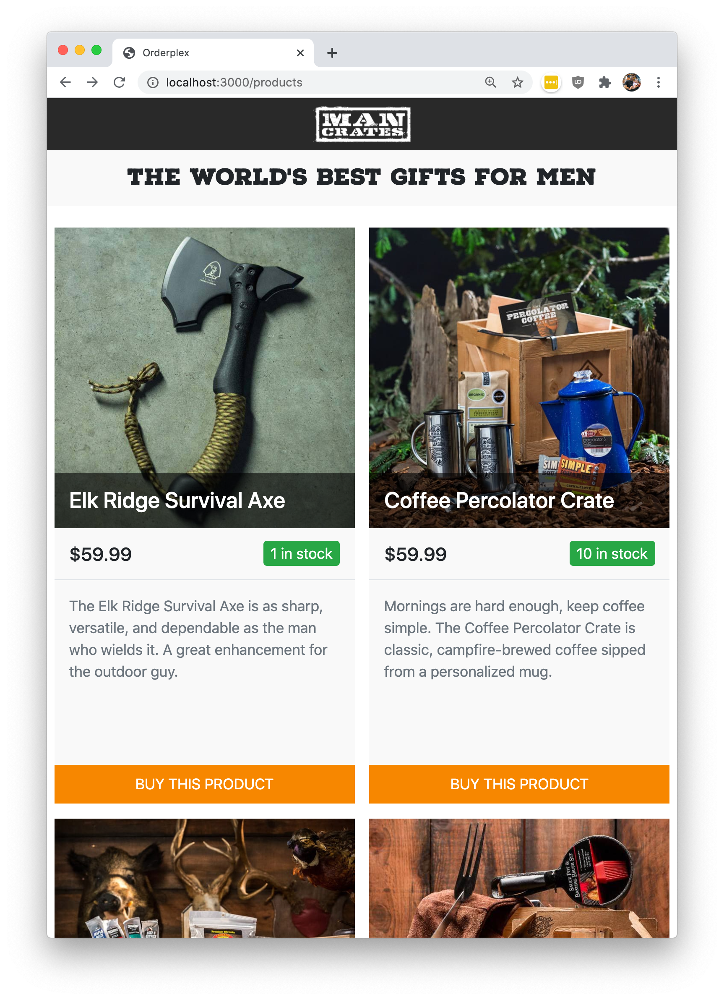

# Orderplex

## Before Starting

The goals of this exercise are to:

1. test your ability to write clean, conventional Rails code
1. test your ability to write well-architected, performant code
1. test your ability to learn something new on the fly

To that end, there isn't a hard time limit. You should go as fast as you can
_without sacrificing code quality_. You should approach this project as if it
was going to eventually go into production on a high-traffic website where
millions of dollars are flowing through the system.

There isn't always necessarily only one right answer, but there are certainly
best-practice ways to accomplish certain things. We encourage you to research
your solution if you aren't sure of the best practice. Feel free to use any
resources available to you.

## System Requirements & Setup

System requirements:

- OS: Mac OSX (recent build) or Debian (Buster or higher), NO Windows support.
- Ruby ~> 2.7.1
- Bundler ~> 2.1
- Node ~> 14
- Yarn ~> 1 (not yarn 2)

To get started, change into your project's root directory and install all
dependencies:

```bash
bundle && yarn
bundle install && yarn
```

Then, set up the database:

```bash
rails db:setup
```

To start the server, run:
```bash
rails server
```

At this point you should be good to go! If you run into any issues getting set
up, please let us know ASAP.

## Background

In a hypothetical world about 65 million years after the extinction of the
dinosaurs, there exists a company called Man Crates that has built a
rapidly-growing e-commerce business.

Up until now they've been handling fulfillment manually, keeping track of stock
on a spreadsheet and updating orders' shipping statuses by hand. We want to
start automating the fulfillment process to improve efficiency, eliminate human
error, and improve customer satisfaction.

## Part 1: Customer Order Endpoint

For Part 1, we'd like you implement an endpoint that processes customer orders.
The endpoint should:

- Receive and validate a customer order
- Check that enough inventory is available to fulfill the order
- Decrement the available inventory if the order is confirmed
- Process concurrent transactions correctly

Below is a sample payload for the endpoint. We've made the
simplifying assumption that each order contains only one kind of product.

```
{
  order:  {
    customer_name: "Jane Doe",
    card_number: "4242424242424242",
    card_exp_month: "01",
    card_exp_year: "2022",
    card_cvc: "123",
    product_id: 1,
    quantity: 2
  }
}
```

To speed things up, we've laid down the groundwork for this task.
`OrdersController` is set up to receive and process orders. We've also already
created a form in `app/views/orders/new.html.erb` that submits data to
`OrdersController`. You can access this form via
http://localhost:3000/orders/new?product_id=1.  Finally, we've provided a
complete implementation for the `Product` model.

First you'll need to complete the `Order` model, by adding the following
attributes:

- `customer_name : string`
- `card_number : string` (length = 16)
- `card_exp_month : string` (valid months only)
- `card_exp_year : string` (digits only)
- `card_cvc : string` (length = 3, digits only)
- `product_id : integer`
- `quantity : integer`

After that, the order form we've provided will load. Then, you'll need to
implement `OrdersController`, so that it correctly checks for out-of-stock
products before creating an `Order` record. Be sure to update the `quantity`
attribute in `Product` whenever an order is processed.

To help with organizing your code, we've created a service object,
`OrderConfirmationsService`, where you can put the bulk of the implementation
for your order processing system, so that it doesn't clutter
`OrdersController`.

## Part 2: Shopping Catalog

For this task, we'd like you to implement a UI that lets the customer shop for
a product. The UI should present a list of products to the customer. Each
item in the list should have the following:

* the product name
* the product price
* quantity available for sale
* a product photo
* a **BUY** button

When the customer clicks the the **BUY** button, redirect them to the new order
form path with the `product_id` appropriately set. You should use the existing
`Product` model to complete this task. We've also provided some seed data in
`db/seeds.rb`. We expect this product list page to be available at `/products`.

To help you, we've created mockups for the mobile and desktop UIs:

### Mobile Mockup


### Desktop Mockup



### Webpacker

We highly recommend that you run the development webpacker script to increase
page load speed:

```bash
./bin/webpack-dev-server
```

### Assets

All product images are loaded with the `seeds.rb` file and stored using
[ActiveStorage](https://edgeguides.rubyonrails.org/active_storage_overview.html).
You can find the image association definition within `models/product.rb`.

### Stylesheet Framework

We use a customized version of
[Bootstrap 4](https://getbootstrap.com/docs/4.0/getting-started/introduction/)
for all our styles. Bootstrap is already installed and available on all pages.
You should be able to dive right in and use any components available in
Bootstrap right away.

### Utilities

Questions about colors, sizes and other small details may arise as you work
through this task. To help answer many of these questions, we've included a
utilities directory `javascript/utilities` that defines many of these fine
details.

At this point you should be good to go! If you run into any issues getting set
up, please let us know ASAP.

## Part 3: Debugging

For this task, we'll be **debugging an open-source software library**: FunJSON. The
source code for the library is "vendored" under `lib/fun_json`.  This library
has a bug - if you run the test suite for it under `tests/lib/fun_json`,
multiple tests will fail:

```bash
rails test test/lib/fun_json
```

However, a contributor has already found a minimal test case in
`tests/lib/fun_json/minimal_test.rb`. You can run this specific test with the
following command:

```bash
rails test test/lib/fun_json/minimal_test.rb
```

Your task is to find and fix the bug so that all tests pass, using any
tools/techniques you want.

## Keep in Mind

In addition to completing the task above, we are looking for you to work as
part of a team with the interviewer. Remember to ask questions and discuss your
plan as you go.

While implementing your solution, pay special attention to **best practices**,
**code quality**, **correctness**, **testing**, **concurrency control** and
**performance**. To the extent possible, implement a solution that would work
well at scale for a business that processes hundreds of thousands of orders per
day.
